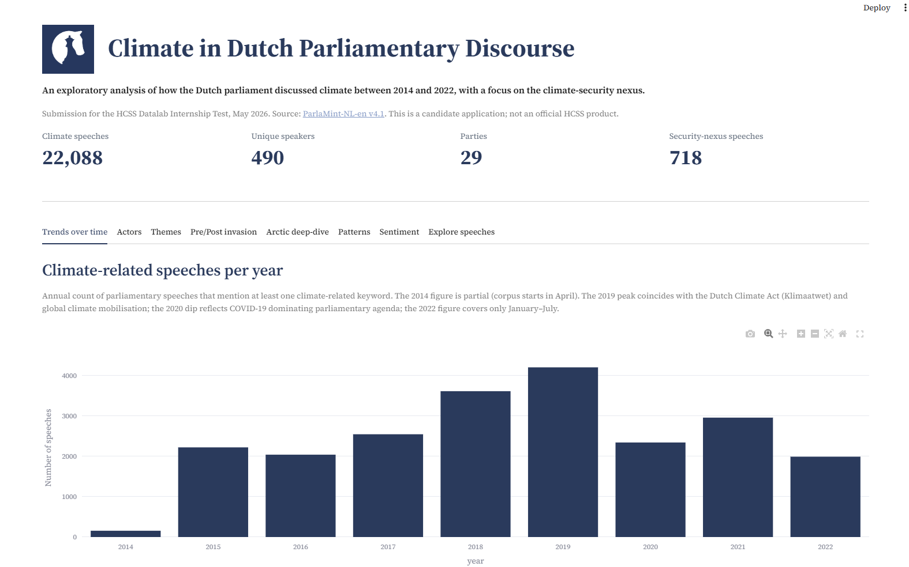
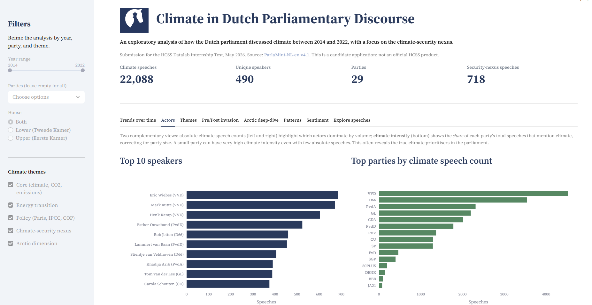
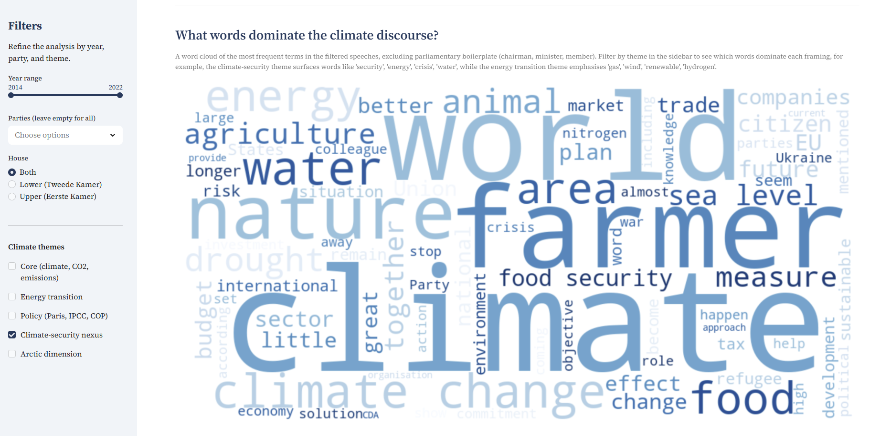
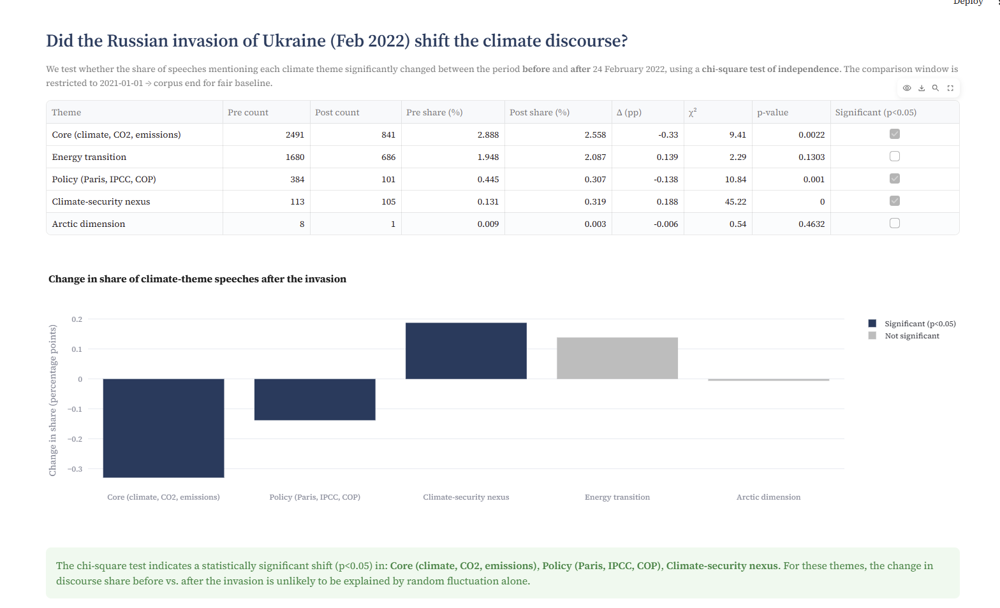
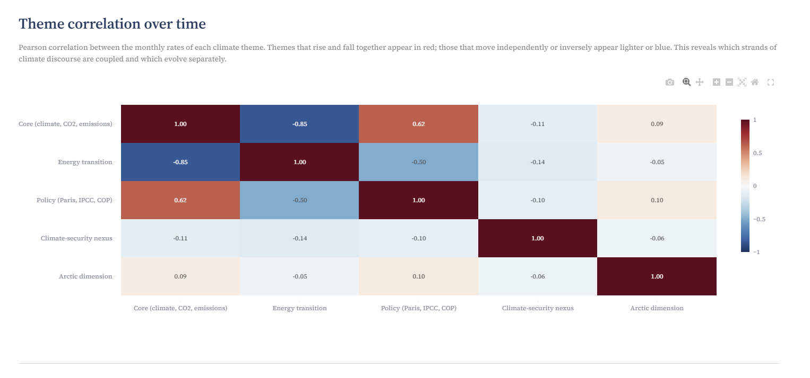
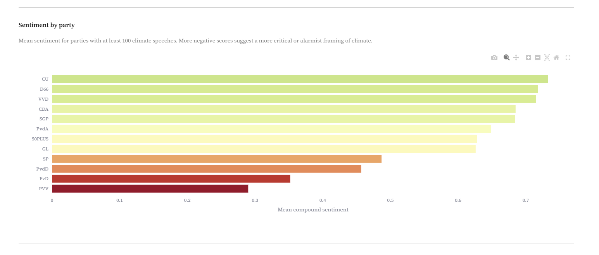

# Climate in Dutch Parliamentary Discourse (2014–2022)

> An interactive analytical tool exploring how the Dutch parliament has discussed climate over an eight-year period, with a particular focus on the climate–security nexus which is a research priority of HCSS.
>
> Built for the **HCSS Datalab Internship Test**, May 2026.

---

## Overview

This project analyses **609,209 parliamentary speeches** from the Dutch Tweede Kamer (Lower House) and Eerste Kamer (Upper House) between April 2014 and July 2022, drawn from the [ParlaMint-NL-en v4.1 corpus](https://www.clarin.si/repository/xmlui/handle/11356/1910). Of these, **22,088 speeches (3.6%)** mention climate-related topics. A subset of **718 speeches (3.2% of climate speeches)** explicitly bridges climate to security, the angle most relevant to HCSS's research priorities.

The deliverable is a Streamlit application that allows analysts and non-technical users to explore the corpus across multiple dimensions: trends over time, actors (speakers and parties), thematic framing, the impact of the Russian invasion of Ukraine, and an Arctic deep-dive case study.

## Research question

**How has the Dutch parliament's framing of climate evolved between 2014 and 2022, and to what extent has the climate–security nexus emerged as a distinct strand of discourse?**

Sub-questions explored in the tool:
- Which speakers and parties have led climate debates, and with what intensity?
- How is climate framed: purely environmental, or as a security/geopolitical issue?
- Did the Russian invasion of Ukraine (24 February 2022) shift the discourse toward energy security?
- How visible is the Arctic dimension: relevant despite the Netherlands being a non-Arctic country and an Arctic Council observer?

## Live application



Launch the app locally:

```bash
streamlit run app/main.py
```

The app provides eight analytical tabs:

| Tab | What it shows |
|-----|---------------|
| **Trends over time** | Annual volume of climate speeches and breakdown by sub-theme |
| **Actors** | Top speakers, top parties, and a "climate intensity" metric correcting for party size |
| **Themes** | Distribution across five sub-themes plus a word cloud that responds to the active filters |
| **Pre/Post invasion** | Chi-square significance test comparing climate discourse before vs. after 24 February 2022 |
| **Arctic deep-dive** | A focused case study on the Arctic dimension, including sample speeches |
| **Patterns** | Theme correlation heatmap and TF-IDF/K-Means clustering of speeches into latent topics |
| **Sentiment** | VADER sentiment analysis of climate speeches, broken down by year, party, and theme |
| **Explore speeches** | Random sampling of individual speeches matching the active filters |

All views respond to a global filter set in the sidebar: **year range**, **parties**, **chamber**, and **theme**.

### Selected views

**Actors — speakers and parties most active on climate**



**Themes — word cloud filtered to the climate-security nexus surfaces a distinct vocabulary (farmer, drought, water, refugee, war)**



**Pre/Post invasion — chi-square significance test confirms a real shift in discourse**



**Patterns — theme correlation reveals competing rather than complementary framings**



**Sentiment — clear ideological gradient: government-aligned parties speak in more positive registers, opposition (left and far right) in more critical ones**



## Data pipeline

```
ParlaMint-NL-en.ana.tgz  (2.65 GB, 6112 XML files)
        │
        ▼  src/data_loader.py  (lxml + custom TEI parser)
        │
all_speeches.csv  (609,209 rows × 14 columns, 517 MB)
        │
        ▼  src/text_processing.py  (regex keyword filtering, 5 themes)
        │
climate_speeches.csv  (22,088 rows × 19 columns)
        │
        ▼  src/analysis.py + app/main.py
        │
Interactive Streamlit dashboard
```

## Project structure

```
hcss-parlamint-climate-security/
├── app/
│   └── main.py                    # Streamlit application
├── src/
│   ├── data_loader.py             # XML parsing, speaker/party metadata
│   ├── text_processing.py         # Keyword filtering, theme tagging, text cleaning
│   ├── analysis.py                # Analytical functions (trends, actors, comparisons)
│   └── config.py                  # (Reserved)
├── notebooks/
│   ├── 01_explore_data.ipynb      # Initial data exploration and full-corpus parsing
│   └── 02_climate_filtering.ipynb # Keyword validation and climate subset creation
├── data/
│   ├── raw/                       # ParlaMint XML (excluded from git)
│   └── processed/                 # Generated CSVs (excluded from git)
├── requirements.txt
└── README.md
```

## Installation

**Prerequisites**: Python 3.10+, ~5 GB free disk space.

```bash
# 1. Clone the repository
git clone https://github.com/beclaire5/hcss-parlamint-climate-security.git
cd hcss-parlamint-climate-security

# 2. Create and activate a virtual environment
python -m venv venv
venv\Scripts\activate          # Windows
# source venv/bin/activate     # macOS/Linux

# 3. Install dependencies
pip install -r requirements.txt

# 4. Download the data
# Download ParlaMint-NL-en.ana.tgz (2.65 GB) from:
# https://www.clarin.si/repository/xmlui/handle/11356/1910
# Place the .tgz file in data/raw/, then extract:
python -c "import tarfile; tarfile.open('data/raw/ParlaMint-NL-en.ana.tgz').extractall('data/raw/')"

# 5. Build the processed CSVs (~15 minutes for parsing, ~1 minute for filtering)
# Run the notebooks in order: 01_explore_data.ipynb then 02_climate_filtering.ipynb

# 6. Launch the app
streamlit run app/main.py
```

## Key design decisions

**Choice of corpus version (4.1, not 5.0)** — The task brief explicitly references the v4.1 file with its MD5 checksum. Even though v5.0 is now available with an additional "war" subcorpus, fidelity to the brief was prioritised; the war/post-invasion split is reconstructed manually from the date attribute.

**Thematic taxonomy** — Five themes were defined (core, energy transition, policy, climate–security nexus, Arctic) rather than a single "climate" flag. This allows users to distinguish between different framings and to spot where climate enters security-coded language. Themes can overlap, which is intentional: a single speech can simultaneously mention CO2 emissions and food security.

**Keyword curation** — Initial Arctic keywords included "polar", which produced many false positives ("polar opposites", "polar freezing" used metaphorically). After validation on real speeches, "polar" was removed, reducing Arctic mentions from 106 to 72 but improving precision substantially.

**Language** — The corpus chosen is the **machine-translated English version** (`ParlaMint-NL-en`) rather than the original Dutch. This makes the interface and analysis accessible to a wider HCSS audience and aligns with the task brief, which specifies this exact file.

**Lxml over BeautifulSoup** — The TEI XML files are large (up to 16 MB each) and deeply nested. `lxml` provides 5–10× the parsing speed of BeautifulSoup and supports XPath queries, which makes navigating the TEI schema cleaner.

**Streamlit + Plotly** — Streamlit was the framework explicitly suggested in the brief, and Plotly was chosen over Matplotlib because its interactivity (hover, zoom, legend toggling) is well-suited to an exploratory dashboard.

## Limitations

- The English text is **machine-translated**: nuances of Dutch political vocabulary may be lost, especially idiomatic expressions and party-specific framing.
- **Keyword-based filtering** is a coarse instrument. A speech that discusses climate without using a keyword from the list is missed; a speech that mentions a keyword in a tangential way is included. For example, the Arctic-theme keyword "Greenland" occasionally captures speeches about the 1982 Greenlandic withdrawal from the European Community ("Grexit") rather than the climate-driven retreat of Greenland's ice sheet. Manual inspection of 5 sampled Arctic-tagged speeches yielded 4 true positives and 1 false positive (~80% precision). More sophisticated approaches (semantic similarity, supervised classifier on labelled examples, co-occurrence filtering) would improve both recall and precision.
- **Speech length is not normalised**: short procedural utterances by chairs are counted equally to substantive 10-minute speeches.
- **No causality is claimed**: shifts in discourse correlate with external events (Paris Agreement, COVID, invasion of Ukraine) but the tool does not establish causal links.

## Database schema design (SQL)

Although the current implementation persists data in CSV (sufficient for a 22k-row analytical workload), a production-grade version of this tool would benefit from a relational schema. The schema below is designed for efficient querying, supports the analyses already implemented, and would scale to the full ParlaMint corpus across all 29 countries (~1B words).

The design follows a normalised star-like schema with `speeches` as the fact table and three dimension tables (`speakers`, `parties`, `meetings`).

### Schema

```sql
-- Dimension: speakers
CREATE TABLE speakers (
    speaker_id      VARCHAR(64)  PRIMARY KEY,
    full_name       VARCHAR(200) NOT NULL,
    sex             CHAR(1),
    birth_year      SMALLINT,
    wikipedia_url   TEXT
);

-- Dimension: parties (parliamentary groups)
CREATE TABLE parties (
    party_id        VARCHAR(64)  PRIMARY KEY,
    abbreviation    VARCHAR(20)  NOT NULL,
    full_name_en    VARCHAR(200),
    full_name_nl    VARCHAR(200)
);

-- Bridge: a speaker can be affiliated with multiple parties over time
CREATE TABLE speaker_affiliations (
    speaker_id      VARCHAR(64)  NOT NULL REFERENCES speakers(speaker_id),
    party_id        VARCHAR(64)  NOT NULL REFERENCES parties(party_id),
    valid_from      DATE         NOT NULL,
    valid_to        DATE,
    PRIMARY KEY (speaker_id, party_id, valid_from)
);

-- Dimension: meetings (one row per parliamentary sitting)
CREATE TABLE meetings (
    meeting_id      VARCHAR(128) PRIMARY KEY,
    meeting_date    DATE         NOT NULL,
    house           VARCHAR(10)  NOT NULL CHECK (house IN ('Lower', 'Upper')),
    subcorpus       VARCHAR(20)  NOT NULL CHECK (subcorpus IN ('reference', 'covid', 'unknown')),
    title           TEXT,
    n_speeches      INTEGER,
    n_words         INTEGER
);

-- Fact: speeches (one row per utterance)
CREATE TABLE speeches (
    speech_id       VARCHAR(128) PRIMARY KEY,
    meeting_id      VARCHAR(128) NOT NULL REFERENCES meetings(meeting_id),
    speaker_id      VARCHAR(64)  REFERENCES speakers(speaker_id),
    role            VARCHAR(32),                       -- chair, regular, etc.
    n_words         INTEGER,
    text            TEXT,                              -- full speech text
    -- denormalised theme flags for fast filter queries:
    is_climate_core             BOOLEAN DEFAULT FALSE,
    is_climate_energy_transition BOOLEAN DEFAULT FALSE,
    is_climate_policy           BOOLEAN DEFAULT FALSE,
    is_climate_security_nexus   BOOLEAN DEFAULT FALSE,
    is_climate_arctic           BOOLEAN DEFAULT FALSE
);

-- Optional: per-speech keyword matches, for fine-grained analysis
CREATE TABLE speech_keywords (
    speech_id       VARCHAR(128) NOT NULL REFERENCES speeches(speech_id),
    keyword         VARCHAR(100) NOT NULL,
    theme           VARCHAR(50)  NOT NULL,
    occurrences     SMALLINT     NOT NULL DEFAULT 1,
    PRIMARY KEY (speech_id, keyword)
);
```

### Indexes for analytical queries

```sql
-- Time-range queries (e.g., "speeches per year on climate")
CREATE INDEX idx_meetings_date ON meetings(meeting_date);

-- Filter by speaker
CREATE INDEX idx_speeches_speaker ON speeches(speaker_id);

-- Theme-based filtering (the boolean flags allow fast partial indexes)
CREATE INDEX idx_speeches_climate_security
    ON speeches(speech_id) WHERE is_climate_security_nexus = TRUE;

-- Keyword search
CREATE INDEX idx_speech_keywords_keyword ON speech_keywords(keyword);
CREATE INDEX idx_speech_keywords_theme ON speech_keywords(theme);

-- Affiliations valid at a given date (for "who was in party X on date Y")
CREATE INDEX idx_affiliations_validity
    ON speaker_affiliations(speaker_id, valid_from, valid_to);
```

### Example queries

```sql
-- 1. Top 10 speakers on climate-security in a given period
SELECT sp.full_name, p.abbreviation, COUNT(*) AS n_speeches
FROM speeches s
JOIN meetings m ON s.meeting_id = m.meeting_id
JOIN speakers sp ON s.speaker_id = sp.speaker_id
JOIN speaker_affiliations sa
     ON sa.speaker_id = sp.speaker_id
    AND m.meeting_date BETWEEN sa.valid_from AND COALESCE(sa.valid_to, CURRENT_DATE)
JOIN parties p ON sa.party_id = p.party_id
WHERE s.is_climate_security_nexus = TRUE
  AND m.meeting_date BETWEEN '2022-02-24' AND '2022-07-12'
GROUP BY sp.full_name, p.abbreviation
ORDER BY n_speeches DESC
LIMIT 10;

-- 2. Monthly time series of climate themes
SELECT DATE_TRUNC('month', m.meeting_date) AS month,
       SUM(CASE WHEN s.is_climate_core              THEN 1 ELSE 0 END) AS core,
       SUM(CASE WHEN s.is_climate_energy_transition THEN 1 ELSE 0 END) AS energy,
       SUM(CASE WHEN s.is_climate_security_nexus    THEN 1 ELSE 0 END) AS security
FROM speeches s
JOIN meetings m ON s.meeting_id = m.meeting_id
GROUP BY 1
ORDER BY 1;

-- 3. Climate intensity per party (corrects for party size)
SELECT p.abbreviation,
       COUNT(*) FILTER (WHERE s.is_climate_core
                          OR s.is_climate_energy_transition
                          OR s.is_climate_policy
                          OR s.is_climate_security_nexus
                          OR s.is_climate_arctic) AS climate_speeches,
       COUNT(*) AS total_speeches,
       ROUND(100.0 * COUNT(*) FILTER (WHERE s.is_climate_core OR s.is_climate_energy_transition
                                        OR s.is_climate_policy OR s.is_climate_security_nexus
                                        OR s.is_climate_arctic) / COUNT(*), 2) AS climate_share_pct
FROM speeches s
JOIN meetings m ON s.meeting_id = m.meeting_id
JOIN speaker_affiliations sa
     ON sa.speaker_id = s.speaker_id
    AND m.meeting_date BETWEEN sa.valid_from AND COALESCE(sa.valid_to, CURRENT_DATE)
JOIN parties p ON sa.party_id = p.party_id
GROUP BY p.abbreviation
HAVING COUNT(*) >= 1000
ORDER BY climate_share_pct DESC;
```

### Scalability considerations

- **Partitioning**: the `speeches` table partitioned by year (`meeting_date`) would keep historical queries fast even as the corpus grows to billions of rows
- **Full-text search**: a generated `tsvector` column on `speeches.text` with a GIN index would enable fast keyword search without scanning all rows
- **Materialized views**: pre-computed monthly aggregates (theme × party × month) refreshed daily would serve the dashboard without re-scanning the fact table
- **Multi-country extension**: adding a `country` column (and corresponding partition key) on `meetings` would extend the schema to all 29 ParlaMint corpora with no structural change

## Possible extensions

- **Sentiment analysis** of climate speeches over time, by party, to detect polarisation
- **Topic modelling (LDA or BERTopic)** to discover latent sub-themes within the climate corpus instead of relying solely on pre-defined keywords
- **Named entity analysis** using the existing NER annotations to track which countries, organisations, and persons appear most often in climate-security speeches
- **Network analysis** of speaker interactions: who responds to whom on climate matters, and how those networks evolved
- **Migration to v5.0** which adds a third subcorpus ("war") and improved language tagging
- **HCSS-style visual identity**: full integration of the HCSS brand palette and typography for a polished demo

## Key findings from the analysis

The tool surfaces several patterns that align directly with HCSS research priorities:

**1. The climate-security nexus more than doubled after the Russian invasion of Ukraine.**
A chi-square test on the discourse window 2021-01-01 → 2022-07-12 shows a highly significant shift (χ² = 45.22, p < 0.0001) in the share of speeches mentioning climate-security keywords (energy security, food security, climate migration, drought, etc.). The share rose from 0.13% pre-invasion to 0.32% post-invasion — a 144% relative increase.

**2. The "core climate" framing receded as the security framing rose.**
Speeches mentioning core climate language (CO2, emissions, greenhouse gases) and policy/treaty language (Paris Agreement, IPCC, COP) both decreased significantly post-invasion (p < 0.005 for both). The discourse appears to have re-securitised: climate is increasingly framed through the lens of geopolitical and energy security.

**3. Theme correlations reveal competing framings, not complementary ones.**
The Pearson correlation between monthly rates of "core climate" and "energy transition" themes is **−0.85**: when one rises in the parliamentary discourse, the other tends to fall. The two framings appear to compete for parliamentary attention rather than reinforce each other. Climate policy, in contrast, correlates positively with core climate (+0.62), suggesting these two are typically discussed together.

**4. The climate-security nexus occupies its own discursive space.**
The climate-security theme shows near-zero correlations with all other themes (-0.10 to -0.14). This suggests it is a distinct register of speech rather than a sub-flavour of the mainstream climate debate — consistent with the idea that climate-security is still an emerging strand of policy discourse in the Netherlands.

**5. Climate champions cluster around expected actors but with one surprise.**
Top speakers on climate include Eric Wiebes (VVD, former Climate Minister), Mark Rutte (VVD, Prime Minister), Henk Kamp (VVD, former Economic Affairs Minister), and Rob Jetten (D66, current Climate and Energy Minister) — all expected. But two members of the small Party for the Animals (PvdD), Esther Ouwehand and Lammert van Raan, also rank in the top 10, despite the party's modest size. Adjusting for party size, PvdD, GroenLinks, and D66 lead in climate intensity (share of their speeches that are climate-related), which more accurately reflects climate prioritisation than absolute counts.

**6. Latent topic clusters reveal six distinct registers in which climate is discussed.**
Unsupervised TF-IDF + K-Means clustering of climate speeches surfaces six recurring patterns: (i) carbon taxation, (ii) economic governance of the transition, (iii) interrogative/critical sustainability questions, (iv) institutional politics (cabinet, European level), (v) parliamentary procedural language, and (vi) concrete energy transition (gas, wind, hydrogen). Four of the six clusters have a clear thematic identity; the remaining two reflect generic procedural language common to all parliamentary debates.

## Tech stack

- **Python 3.13**
- **lxml** — TEI XML parsing
- **pandas, numpy** — data manipulation
- **Streamlit** — interactive web interface
- **Plotly Express** — interactive visualisations
- **scikit-learn, NLTK** — text processing utilities (used selectively)
- **tqdm** — progress bars during corpus parsing

## Author

**Chiara Barontini** — applying for the Data Internship at HCSS Datalab.
[GitHub](https://github.com/beclaire5) · [LinkedIn](https://www.linkedin.com/in/chiara-barontini-4535803a9/)

## Data attribution

ParlaMint-NL-en v4.1 by Tomaž Erjavec et al., distributed via CLARIN.SI under CC BY 4.0.
